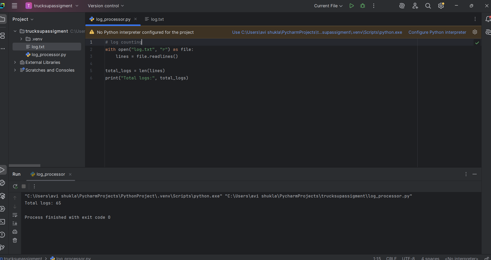
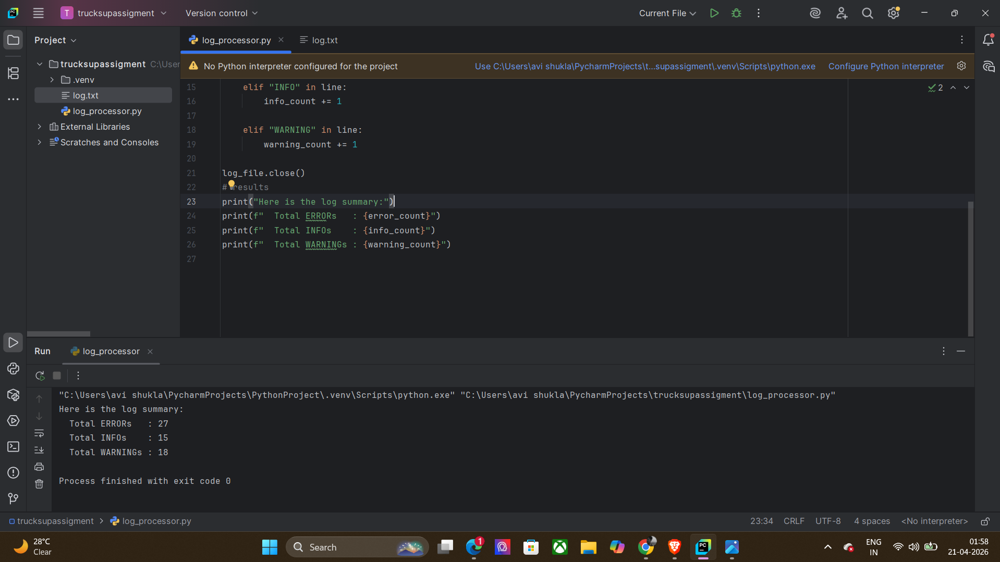
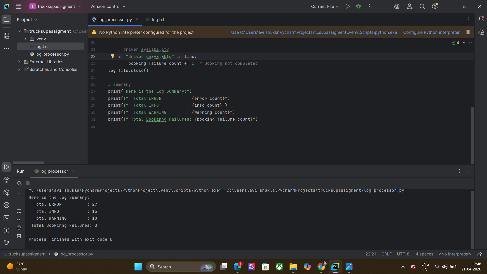
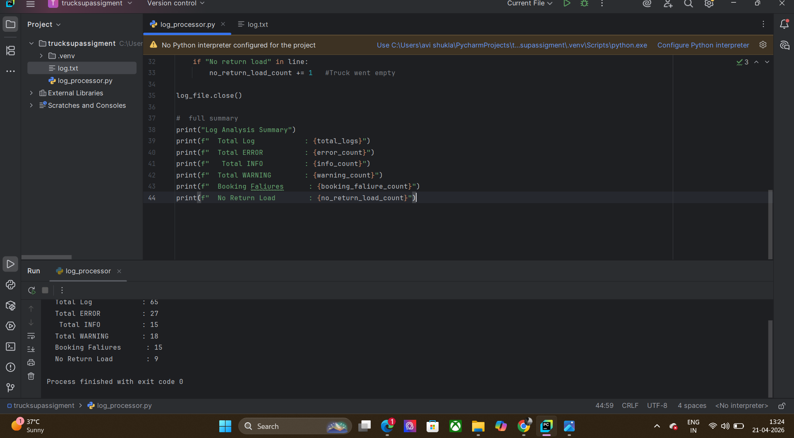
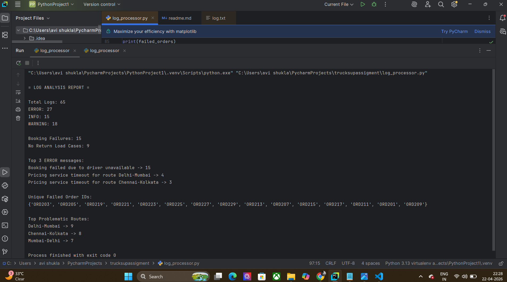
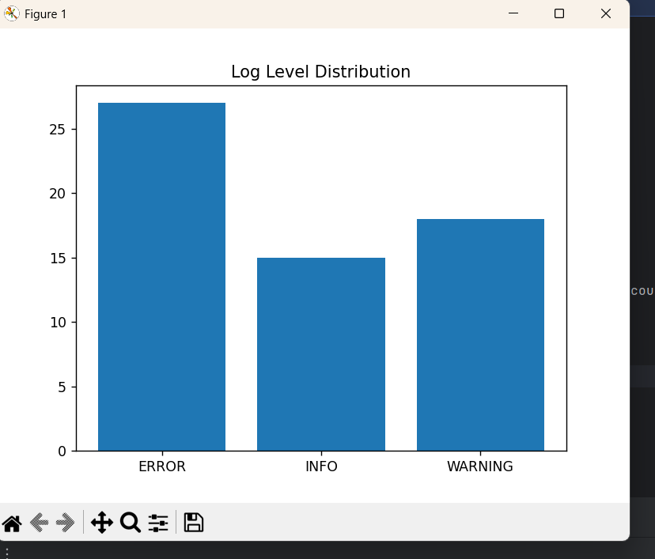

# Log Analyzer Project

##  Steps to Run the Program

1. I made my project in python which possibliy runs on every available IDE's (I have tested on pycharm ans vs code )...
2. Install matplotlib:
   pip install matplotlib  (imp otherwise code will not run )   # I have added this feature by myself ..
3. Keep these files in same folder:

   * logprocessor.py
   * log.txt
4. Open terminal in that folder
5. Run:
   python logprocessor.py

Output will be shown and graph will be shown 

***

##  Logic

I started by testing small parts like reading the file and counting logs which i have done on pycharm i have added screenshot for each test which i have done .
After that, I combined everything into one program.

The program reads the file line by line.

It does:

* Count total logs
* Separate logs into ERROR, INFO, WARNING
* Find booking failures using "driver unavailable"
* Find empty runs using "No return load"

I used: (which i revised  first )

* Counter → for top errors and routes
* Regex → to extract orderId and route
* Set → to store unique failed order IDs

## Enhancement

I added a graph using matplotlib.
which shows:

* ERROR count
* INFO count
* WARNING count

It makes the output easier to understand.

## Screenshots

* Testing code 
               
               
                 
* Final output 
* Graph 

## Assumptions

* Log format is same everywhere
* ERROR / INFO / WARNING all three exist always 
* "driver unavailable" = booking failure
* "No return load" = empty truck
* Routes are like Delhi-Mumbai
* orderId format is always in orderId=XXXX

## Limitations (these are enhancement i have not done )

* Command line input not added
* Large file handling is basic

****************************

#  Conclusion

This aasignment helps me to  understand the implementation of code in real lifeand its  usage and how  to make things easy to understand and impelment .....
